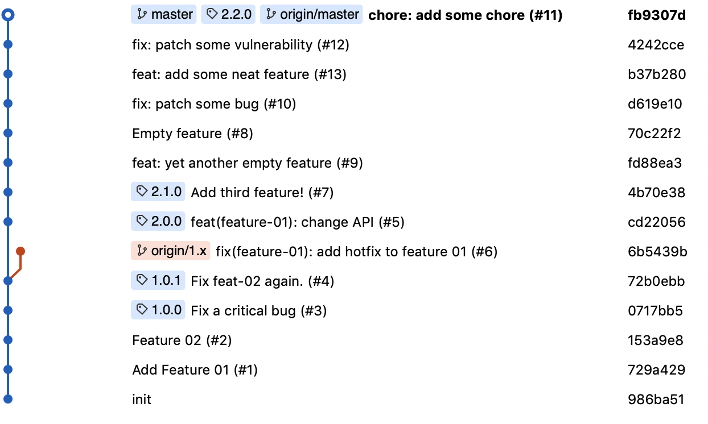

# Fork-only Rebase/Squash Merging Approach
- When a pull request passes all checks and reviews, a core maintainer with write access to `master` merges via `Squash and Merge`.
- All PRs are come from forked repos. It is up to the contributor to make sure it is rebased onto `upstream/master` before submitting.
- If during a PR, `master` gets updated, the contributor should rebase off of their `upstream/master` and `git push --force-with-lease` to their branch.
- The only branches that will remain on the primary repo will be legacy support (if `master` is on `4.x` then a branch could be named `3.x`, for example) or other experimental branches perhaps.

## Tradeoffs
- Pros:
  - The merge message defaults to `<Commit Msg/Branch Name> (PR #)` which helps us reference the PR url from changelogs or the commit history in Github since it automatically becomes an href.
  - This gives maintainers an opportunity to clean up some commit messages if needed and adjust the title of the PR so that the commit history reads nicely.
  - Maintainers no longer need to monitor commit messages to see if they make sense. Or ask people to amend commits.
  - It's easy to rollback PRs.
  - The Git commit history is really clean with this approach, no merge commits and very concise.
  - This pattern encourages compact PRs with a singular goal.
  - By making all contributors fork, your tree visualization doesn't get cluttered with lots POC/stale branches that have been pushed up for saving work. Everyone pushes work to their own fork.
  - It removes a step in deleting merged branches after merging.
  - Contributors are responsible for pruning their own repos and local branches.
  - Contributors need to worry about less about the contribution workflow.
  - We don't have to worry about giving all potential contributors access rights to the repo.
- Cons:
  - Merging requires more responsibility. It's up to the maintainer who merges to add the correct message to the commit.
  - It's very difficult to roll back singular commits.
  - Pulling down forked repos to run PRs locally is harder on code reviewers.
  - There is lack of visibility in what branches are in flight. So we may be surprised by incoming PRs.

## Open Questions
- How do we handle long-running branches or future development not on the current version line?
- How do we trigger CI releases? Github releases? Tag and push?
- Where does Storybook live? Should we stay on Github pages? Build and push to Netlify instead?
- How do we do versioning with CI since we want a compact, descriptive history?
- Should we version manually and do release PRs?
- Do we ever need to reference the Storybook build at all? Should the artifacts even be in our codebase?

## What the tree looks like

